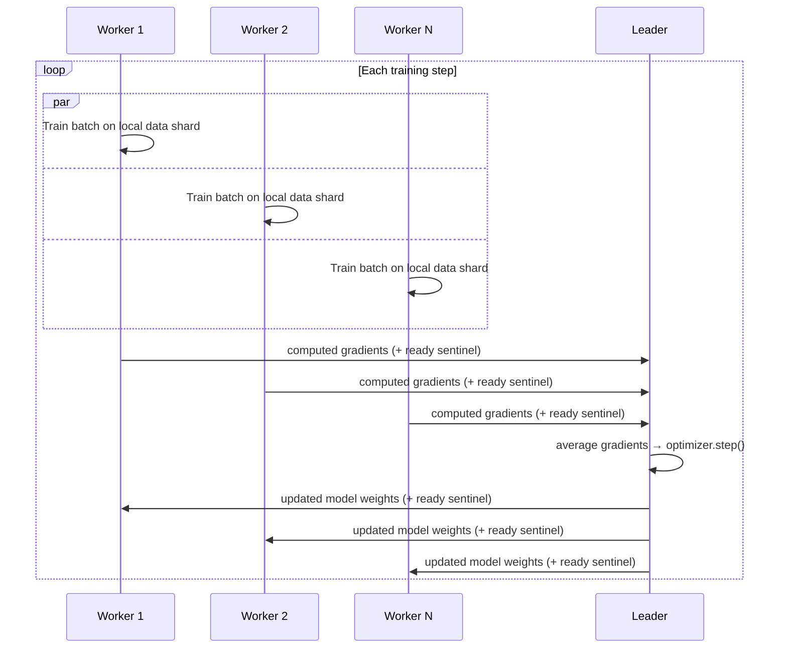
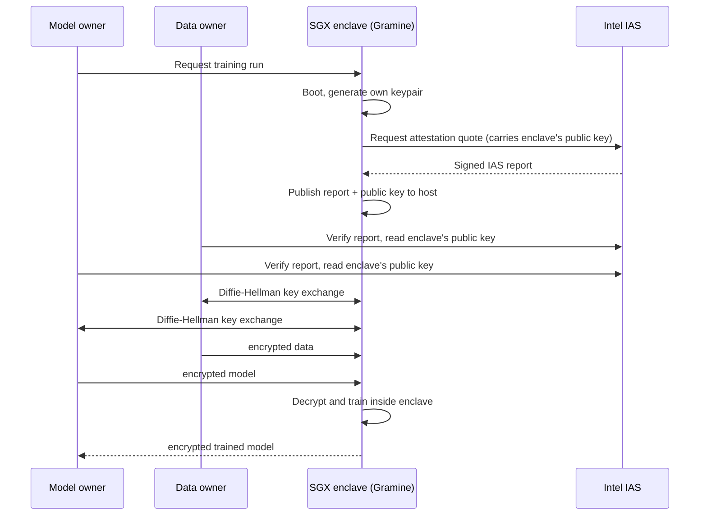
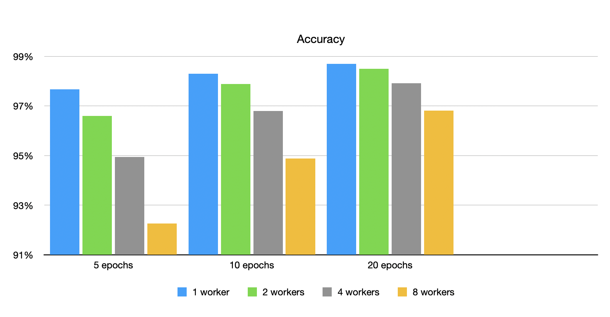

# mcy-sgx-gramine

> **Mercury Protocol · confidential, distributed PyTorch training.**
> Off-chain nodes that run user-supplied PyTorch training inside Intel SGX enclaves (via Gramine), produce a remote-attestation report per run, and exchange encrypted gradients between a leader and N workers — so a decentralized AI-training network can prove *this model was trained on this code and this data* without anyone trusting the node operator.

## Context

Mercury is a decentralized peer-to-peer GPU network for training AI models, designed to give developers cheaper and privacy-preserving compute by tapping the world's dormant CPUs and GPUs. The off-chain node has three roles:

- **Watcher** — picks up work requests from the blockchain, estimates compute requirements, selects nodes, and posts the resulting attestations back on-chain. Lives upstream in [Vulkan](https://github.com/mercury-protocol/vulkan) and the smart-contract layer.
- **Leader** — aggregates gradients from the workers each step and broadcasts the updated state dict back.
- **Worker** — trains the user's model on its shard of the data and emits gradients.

This repository contains two of the foundational pieces of the off-chain node:

- **`mcy_dist_ai/`** — the leader and worker, published as a PyPI package. Drops into the Vulkan transport layer; gives Mercury its synchronous data-parallel training.
- **`app/` + `remote/`** — a Gramine SGX enclave application that proves out the attestation and encrypted-channel flow underpinning Mercury's verifiable-compute story. In production, attestations produced inside the enclave are forwarded by the leader to the watcher, which posts them on-chain.

Both subsystems are MVPs of their respective layers, running entirely on CPU TEEs; extending verifiable execution to the GPU is described in the Mercury Litepaper as future work.

---

## Architecture

### Distributed training (`mcy_dist_ai/`)

Each process is launched as either a `LEADER` or a `WORKER`. Workers train batches on local data shards and emit gradients; the leader averages them, applies the optimizer step, and broadcasts the new state dict back. Synchronous stochastic gradient descent over file-based inter-process communication.



The Vulkan transport ships these files between hosts; this package only assumes they arrive. A `<name>.pth` + `<name>_ready.pth` sentinel pair handles producer/consumer races without locks.

### Confidential model training (`app/`, `remote/`)

A Python application runs inside an Intel SGX enclave via Gramine — a hardware-isolated region of CPU memory that even the machine's own operating system cannot read into. Before sending anything sensitive, the remote party fetches the enclave's IAS attestation report (a signed statement from Intel saying "this exact code is running inside a genuine SGX enclave on a genuine Intel CPU") and verifies it. They then perform an ECDH key exchange (NIST P-256, the standard elliptic-curve handshake used in TLS) to derive a shared secret with the enclave without ever transmitting a key over the wire — and they do this twice, once for the data and once for the model, so the two channels are cryptographically independent. Payloads are then encrypted with Fernet (authenticated symmetric AES) under those keys and shipped in. The enclave decrypts inside the protected region, runs the model, and returns the encrypted result the same way back out.



Each [*Diffie-Hellman key exchange*](https://en.wikipedia.org/wiki/Diffie%E2%80%93Hellman_key_exchange) arrow above is shorthand for: both parties send each other their public keys, then each combines its own private key with the counterpart's public key to land on the same shared secret. Only public keys travel between them; the secret itself never crosses the wire. Two arrows means two handshakes, so the data and model channels end up with cryptographically independent secrets.

Two channels exist because Mercury's threat model treats the data owner and model owner as potentially distinct, mutually-distrustful parties — both shipping IP to the same untrusted compute provider. The same IAS report the remote parties verify is what the watcher will eventually upload on-chain as the verifiable-compute proof.

### Threat model

The untrusted node operator is assumed to control the host OS, the filesystem, and the network. Four concrete attacks the design defends against:

- **Enclave compromise** (host OS or hypervisor reads enclave memory) — defeated by SGX hardware memory isolation; the Gramine manifest at [app/sgxapp.manifest.template](app/sgxapp.manifest.template) defines the trust boundary, declaring which host files are allowed in and forbidding everything else.
- **Key exfiltration** (host steals the enclave's long-lived ECDH private key off disk) — the key is the only file mounted `type = "encrypted"` and is sealed against `MRENCLAVE`, so only a byte-identical rebuild of the enclave on the same CPU can unseal it. Session secrets exist only in enclave memory.
- **Attestation forgery** (host fabricates a "running inside SGX" claim) — defeated by the IAS-signed quote generated inside the enclave ([app/attestation.py](app/attestation.py)); remote parties verify the Intel signature against the published certificate chain before sending any encrypted payload. The quote binds the enclave's public key in `user_report_data`, so a stale report cannot be paired with a key the attacker controls.
- **Replay** (resending a captured ciphertext, or pairing an old IAS report with new traffic) — both sides generate a fresh ECDH keypair per run ([app/sgx_startup.py](app/sgx_startup.py) at enclave boot, [remote/simulated_remote.py](remote/simulated_remote.py) per session), so every session derives a different Fernet key and intercepted ciphertexts from a previous run will not decrypt under the new key. Pairing a stale IAS report with new traffic fails for the same reason: the public key bound into the report's `user_report_data` is the one ciphertexts were encrypted to, so swapping reports breaks the handshake.

Not defended against:

- **SGX side channels** (cache timing, page-fault patterns, branch prediction, speculative execution). The enclave makes no attempt at constant-time operations or oblivious memory access; Mercury inherits the standard limits of SGX's confidentiality model.
- **Malicious model code inside the enclave.** [app/sgx_train_model.py](app/sgx_train_model.py) `exec`s the decrypted model source, so a model owner can in principle observe or smuggle out the data owner's plaintext via output channels. The two encryption channels protect the wire between mutually-distrustful parties; they do not isolate those parties from each other once both their payloads are inside the same enclave.

---

## Notable engineering decisions

- **File-based IPC, not sockets.** Gramine's SGX backend constrains network APIs. Since the production target is workers running inside enclaves, all node coordination already uses files declared as enclave inputs and outputs.
- **Sentinel-file ready protocol.** Each transfer is two files (`x.pth` + `x_ready.pth`) so consumers never read a half-written tensor. The transport layer can copy in any order without coordination.
- **Plugin contract for user models.** The framework imports a user-supplied `user_script.py` dynamically and pip-installs the accompanying `user_requirements.txt` at startup. Users define their model, optimizer, data loader, and per-batch training function — the framework provides the distributed orchestration around them, with no DevOps for the user.
- **Manifest-enforced trust boundary.** Inside the enclave only the long-lived ECDH private key is sealed (`type = "encrypted"`, bound to MRENCLAVE). Every other file is host-readable by design; secrets only exist in memory while the enclave is running.
- **Two encryption channels, not one.** Data and model arrive over separate ECDH handshakes so the data owner and model owner can be independent parties on the Mercury marketplace, neither having to trust the other.
- **Attestation-gated execution.** Training does not start until the IAS report has been written; remote parties refuse to send their encrypted inputs until they have verified the report themselves. The same report is what the watcher will eventually upload on-chain as the verifiable-compute proof.
- **End-to-end tests run real code, not mocks.** A multi-process harness replaces the P2P transport with a local file shuttler and spawns the actual leader and worker processes; assertions are on the resulting model's accuracy.

---

## Install & use

### As a library

```bash
pip install mcy_dist_ai
```

Write a `user_script.py` exposing the required symbols — full contract in [docs/user_script_requirements.md](docs/user_script_requirements.md), worked example in [tests/examples/image_classifier/user_script.py](tests/examples/image_classifier/user_script.py) — plus a `user_requirements.txt` for its dependencies. The Vulkan layer then launches the leader and N workers on participating peers.

### `mcy-split-data` CLI

Pre-splits a dataset into N tensor partitions so heavy preprocessing runs once instead of per worker:

```
mcy-split-data <split_into> <data_path> <output_dir_path> <user_script_path>
```

Workers launched with `--tensor_load` consume these partitions directly.

### Running the SGX enclave

Requires SGX-capable hardware and Intel IAS credentials (`IAS_API_KEY`, `RA_CLIENT_SPID`) in a project-root `.env`. Full instructions in [docs/sgx_app.md](docs/sgx_app.md). In short:

```bash
sudo docker-compose up app                    # builds and runs the enclave
sudo python3 remote/simulated_remote.py       # plays the data + model owner
```

`sudo` is required on both sides: the container needs root to access the host's `/dev/sgx_enclave` and `/dev/sgx_provision` device nodes, and the remote simulator inherits that requirement because it shares filesystem state with the root-launched container.

The `remote/` simulator trains a baseline locally and asserts the enclave-returned model matches it — the round-trip is the test.

---

## Layout

```
mcy_dist_ai/    Published Python package — leader, worker, user-script integration
app/            Enclave entrypoints, attestation, encrypted channels, Gramine manifest
remote/         Untrusted counterpart to app/, used for local end-to-end testing
tests/          Multi-process simulation harness and example user scripts
docs/           User-script contract, SGX flow, sample attestation reports
```

---

## Testing

```bash
pip install -r requirements_test.txt
pytest tests/
```

End-to-end tests run the real leader and worker code under a simulated network. Each node is launched in its own OS process via `multiprocessing`, with a role-specific argv and an isolated working directory under `tests/temp/`. Because the package resolves all coordination paths against the process `cwd` at import time, every child inhabits an independent filesystem namespace — the same isolation it would see on a separate host, with its own logger, its own user-script import, and its own copy of the per-node configuration. The Vulkan transport layer is replaced by an asynchronous file shuttler that copies gradient and state-dict files between those directories on the producer/consumer sentinel pattern the production transport uses.

The harness supports arbitrary worker counts and can run the network either fully in parallel or sequentially. Included tests train MNIST classifiers with 1, 2, 4, and 8 workers and assert on classification accuracy; an LLM fine-tuning example is also included as a work-in-progress.

---

## Requirements

- Python 3.10+
- PyTorch (pinned in `requirements.txt`)
- For the enclave: SGX-capable CPU and Gramine 1.5

---

## Benchmarks

Small OCR classifier trained across 1 / 2 / 4 / 8 simulated worker nodes (multiprocessing + asyncio file shuttler), measured at 5, 10, and 20 epochs.



| Epochs | 1 worker | 2 workers | 4 workers | 8 workers |
|---|---|---|---|---|
| 5  | 97.67% | 96.60% | 94.95% | 92.26% |
| 10 | 98.30% | 97.88% | 96.80% | 94.88% |
| 20 | 98.70% | 98.50% | 97.91% | 96.81% |

At 20 epochs the 1→8 worker spread narrows to ~1.9 percentage points. The early-epoch gap is a step-count effect: each round averages all worker gradients into a single leader step, so an N-worker epoch yields ~1/N as many weight updates as a 1-worker epoch (equivalently, an N×-larger effective batch). Enough additional epochs make the gap negligible.

---

## What's interesting (for reviewers)

- **Gramine manifest** at [app/sgxapp.manifest.template](app/sgxapp.manifest.template) — what is trusted-input, allowed-host-file, or sealed; the enclave's trust boundary in one file.
- **Attestation gate** at [app/attestation.py](app/attestation.py) and the enclave entrypoint at [app/sgx_main.py](app/sgx_main.py) — IAS report generation and the "no inputs accepted before the report is on disk" handshake.
- **ECDH + Fernet channels** at [app/sgx_utils.py](app/sgx_utils.py) and the host-side mirror at [remote/utils.py](remote/utils.py) — why the utilities are deliberately duplicated across the trust boundary.
- **Local end-to-end test** at [remote/simulated_remote.py](remote/simulated_remote.py) — trains a baseline locally and asserts the enclave-returned model matches it; the round-trip is the test.
- **Leader/Worker coordination** at [mcy_dist_ai/leader.py](mcy_dist_ai/leader.py) and [mcy_dist_ai/worker.py](mcy_dist_ai/worker.py) — sentinel-file ready protocol, single-worker short-circuit, async file monitor.
- **User-script plugin contract** at [docs/user_script_requirements.md](docs/user_script_requirements.md) — the four symbols a user provides; everything around them is orchestration.

---

## License

MIT — see [LICENSE](LICENSE).
